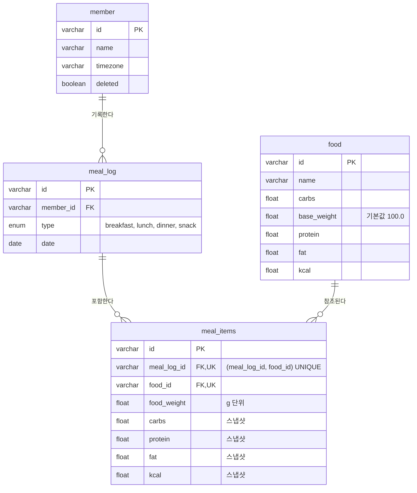

# ERD

- 사용자가 food를 생성하거나, 다른 사용자가 만든 걸 중량을 추가해 사용할 수 있다.
- pk 값은 id를 쓰며, UUID 값으로 사용한다.
- created_at, updated_at은 모든 테이블에 기본적으로 적용한다.
- 한 끼니에 같은 음식 2번 비허용. meal_items에 (meal_log_id, food_id) UNIQUE 제약으로 막는다.
  - PK는 다른 테이블과 동일하게 id(UUID)를 유지한다.

### 다이어그램

created_at, updated_at은 생략했다.




### member

사용자 정보, timezone 세팅 등.

```sql
CREATE TABLE member (
    id         VARCHAR(36)  NOT NULL,
    name       VARCHAR(255) NOT NULL,
    timezone   VARCHAR(64)  NOT NULL COMMENT 'IANA timezone (예: Asia/Seoul)',
    deleted    BOOLEAN      NOT NULL DEFAULT FALSE,
    created_at DATETIME     NOT NULL DEFAULT CURRENT_TIMESTAMP,
    updated_at DATETIME     NOT NULL DEFAULT CURRENT_TIMESTAMP ON UPDATE CURRENT_TIMESTAMP,
    PRIMARY KEY (id)
) ENGINE = InnoDB DEFAULT CHARSET = utf8mb4;
```

### food

음식 정보. (예: 닭가슴살), 탄단지/칼로리 포함

```sql
CREATE TABLE food (
    id          VARCHAR(36)  NOT NULL,
    name        VARCHAR(255) NOT NULL,
    carbs       FLOAT        NOT NULL,
    base_weight FLOAT        NOT NULL DEFAULT 100.0 COMMENT '기본 중량. 이 값에 따라 영양 정보도 달라진다.',
    protein     FLOAT        NOT NULL,
    fat         FLOAT        NOT NULL,
    kcal        FLOAT        NOT NULL COMMENT '탄단지 4/4/9로 계산하지 않고 별도로 받는다.',
    created_at  DATETIME     NOT NULL DEFAULT CURRENT_TIMESTAMP,
    updated_at  DATETIME     NOT NULL DEFAULT CURRENT_TIMESTAMP ON UPDATE CURRENT_TIMESTAMP,
    PRIMARY KEY (id)
) ENGINE = InnoDB DEFAULT CHARSET = utf8mb4;
```

### meal_log

```sql
CREATE TABLE meal_log (
    id         VARCHAR(36) NOT NULL,
    member_id  VARCHAR(36) NOT NULL,
    type       ENUM ('breakfast', 'lunch', 'dinner', 'snack') NOT NULL,
    date       DATE        NOT NULL COMMENT '특정 날짜 (2026-09-27). timezone 어떻게 할건지 정책 필요',
    created_at DATETIME    NOT NULL DEFAULT CURRENT_TIMESTAMP,
    updated_at DATETIME    NOT NULL DEFAULT CURRENT_TIMESTAMP ON UPDATE CURRENT_TIMESTAMP,
    PRIMARY KEY (id),
    FOREIGN KEY (member_id) REFERENCES member (id)
) ENGINE = InnoDB DEFAULT CHARSET = utf8mb4;
```

### meal_items

meal_log와 food를 N:M 관계로 잇는 연결 테이블이자, 중량, 탄단지/칼로리 스냅샷

```sql
CREATE TABLE meal_items (
    id          VARCHAR(36) NOT NULL,
    meal_log_id VARCHAR(36) NOT NULL,
    food_id     VARCHAR(36) NOT NULL,
    food_weight FLOAT       NOT NULL COMMENT '음식 중량 g단위. 따로 입력하지 않을 시, food에 있는 값을 복사한다.',
    carbs       FLOAT       NOT NULL,
    protein     FLOAT       NOT NULL,
    fat         FLOAT       NOT NULL,
    kcal        FLOAT       NOT NULL,
    created_at  DATETIME    NOT NULL DEFAULT CURRENT_TIMESTAMP,
    updated_at  DATETIME    NOT NULL DEFAULT CURRENT_TIMESTAMP ON UPDATE CURRENT_TIMESTAMP,
    PRIMARY KEY (id),
    UNIQUE KEY uk_meal_items_meal_log_food (meal_log_id, food_id),
    FOREIGN KEY (meal_log_id) REFERENCES meal_log (id),
    FOREIGN KEY (food_id) REFERENCES food (id)
) ENGINE = InnoDB DEFAULT CHARSET = utf8mb4;
```
